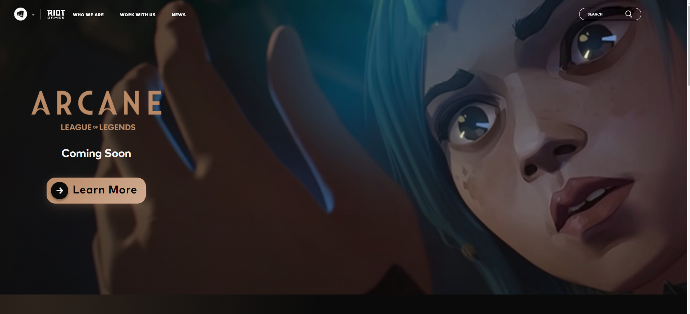

1So, what is semantic UI? Well basically it’s like a library with code already made ready for use. It is kind of like the underscore function in java script or the standard C++ library. Honestly while learning semantics UI it felt like I was learning another coding language in a HTML format. Although I haven’t thoroughly gone through everything semantics UI has to offer, I feel like as long as you know some of the basics and how to search for things you can go far.

Semantic UI is there to help us make simpler cleaner code all the while making very user friendly and visually appealing websites. It doesn’t do all the work for us, but it helps us put our creative imagination into code. Yes, it is hard to learn but I feel that the benefit and payoffs is worth it. It saves you time by simplifying how you structure code. What would normally take a handful of lines may only take two lines while using semantics UI. It may not seem like a big deal, but it is. Have you every had a moment while coding where you are just in the zone, and everything is connecting like the matrix and the ideas pouring out of your head? Well since you saved all the time and hassle by using semantics UI you won’t run into any roadblocks. These roadblocks could hinder your “in the zone” moment and you may even get a hiccup that causes you to lose sight of the amazing idea you had in your head that you were just minutes away from fabricating. Therefore, in my opinion it is better to learn semantics UI rather than just slugging it out and using strictly HTML and CSS. The saying “Teach a man to fish and he’ll eat for a lifetime” seems rather fitting here. Semantics UI is what’s going to excel the growth and quality of our codes.

 
