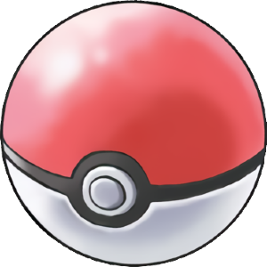

  

I took an ICS class where I would learn C/C++. Hearing how it was like Java and how everyone said it was easy I brushed it off as easy too. That was a mistake because although C++ maybe share some similarities with Java it is a whole other beast. Learning about pointers was probably one of the single most confusing concepts I had ever had to learn. 

Me and my team had to make a pokemon game using C++. Having to figure out how to use pointers properly and efficiently was no easy task. The amount of trouble shooting and tracing I had to do for this project helped me build a good understanding of how pointers worked. Another thing was that it helped me become a better problem solver. There were a lot of times during this project where I would just hit a dead end or draw blanks. One of the ways I overcame this issue was to take breaks when needed and try not to force an answer. Another skill I picked up was learning how to read another person’s code. That was probably one of the most frustrating things I had to deal with especially when team members refuse to comment on changes they made to the code. 

