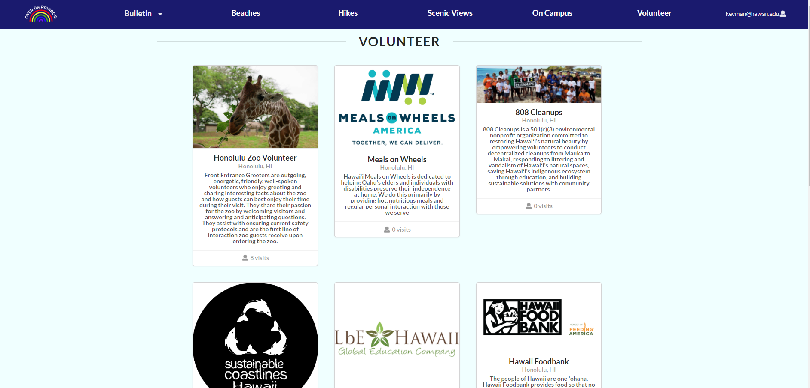

  

##Teamwork Makes The Dream Work 
The project that me and my group mates worked on is called [Over Da Rainbow](https://overdarainbow.xyz/#/). This is the first web-based application that I have done with a group that I am actually happy about. This web application is about helping UH Manoa faculty and students find cool and intriguing things to do and places to go. When working in a group there are a lot of challenges that could either make or break the group. I learned quickly that proper communication is essential to getting things done. We would hold group meetings twice a week to make sure that everyone was able to keep up with their tasks. We also had a discord server to help improve the effectiveness and efficiency with communicating with one another. Another challenge was trying to get everyone to visualize the same idea or understand how things are supposed to look. One way we overcame this was to do mockups or drawings of how we imagined the web pages and layouts would look. 

 
   

 

##Different Is Not Always Bad 
We each had our own strengths and weaknesses in the group. That is just a natural thing that happens whenever you work with people. I believe that I played a big part in the management and being able to group our ideas together and have clear attainable goals. I also helped with a lot of the mock-ups that we did. Everyone has their own opinions on things and that’s good but having too many differing opinions on one subject makes it hard to complete the task. I lot of times I had to help everyone see the objective clearly and to deny or accept a change through majority rules. I also helped a lot with content research. Being able to get all the places and activities that were available and accessible on the island. We had a good portion of people who were really good at coding, so they took on some of the heavier programming loads. Admittingly my strengths were not that great in the coding department but in everything else I felt pretty confident. As far as coding I feel I pulled my fair share with some of the components, pages, and collections that we had along with running testcafe. Are strengths maybe different but I think that’s what made our team great. 
